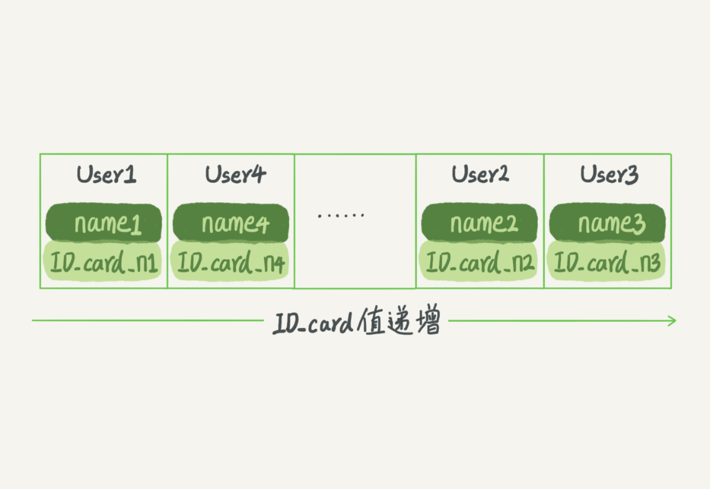
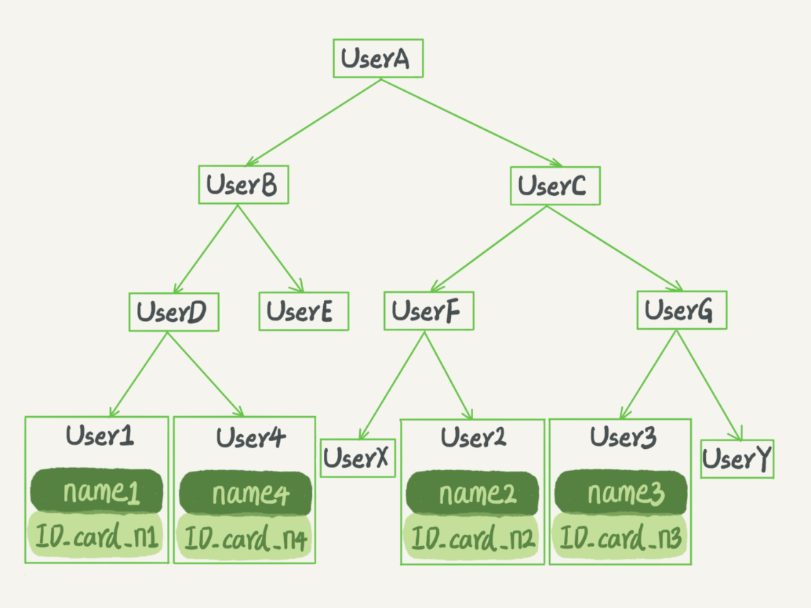

#### 04 | 深入浅出索引（上）

-----------------

索引的出现其实就是为了提高数据查询的效率，就像书的目录一样。

##### 索引的常见模型

1. **哈希表**

   假设，你现在维护着一个身份证信息和姓名的表，需要根据身份证号查找对应的名字，这时对应的哈希索引的示意图如下所示：

   

   图中，User2 和 User4 根据身份证号算出来的值都是 N，但没关系，后面还跟了一个链表。假设，这时候你要查 ID_card_n2 对应的名字是什么，处理步骤就是：首先，将 ID_card_n2 通过哈希函数算出 N；然后，按顺序遍历，找到 User2。

   需要注意的是，图中四个 ID_card_n 的值并不是递增的，这样做的**好处是增加新的 User 时速度会很快**，只需要往后追加。但缺点是，因为**不是有序的**，所以哈希索引做区间查询的速度是很慢的。

   所以，哈希表这种结构适用于只有等值查询的场景，比如 Memcached 及其他一些 NoSQL 引擎。

2. **有序数组**

   **有序数组在等值查询和范围查询场景中的性能就都非常优秀**

   上面这个根据身份证号查名字的例子，如果我们使用有序数组来实现的话，示意图如下所示：

   

   这里我们假设身份证号没有重复，这个数组就是按照身份证号递增的顺序保存的。这时候如果你要查 ID_card_n2 对应的名字，用二分法就可以快速得到，这个时间复杂度是 O(log(N))。

   同时很显然，这个索引结构支持范围查询。你要查身份证号在[ID_card_X, ID_card_Y]区间的 User，可以先用二分法找到 ID_card_X（如果不存在 ID_card_X，就找到大于 ID_card_X 的第一个 User），然后向右遍历，直到查到第一个大于 ID_card_Y 的身份证号，退出循环。

   如果仅仅看查询效率，有序数组就是最好的数据结构了。但是，**在需要更新数据的时候就麻烦了，你往中间插入一个记录就必须得挪动后面所有的记录，成本太高**。

   所以，有序数组索引只适用于静态存储引擎，比如你要保存的是 2017 年某个城市的所有人口信息，这类不会再修改的数据。

3. **二叉搜索树**

   

   二叉搜索树的特点是：父节点左子树所有结点的值小于父节点的值，右子树所有结点的值大于父节点的值。这样如果你要查 ID_card_n2 的话，按照图中的搜索顺序就是按照 UserA -> UserC -> UserF -> User2 这个路径得到。这个时间复杂度是 O(log(N))。

   **当然为了维持 O(log(N)) 的查询复杂度，你就需要保持这棵树是平衡二叉树。为了做这个保证，更新的时间复杂度也是 O(log(N))。**

   树可以有二叉，也可以有多叉。多叉树就是每个节点有多个儿子，儿子之间的大小保证从左到右递增。二叉树是搜索效率最高的，但是实际上大多数的数据库存储却并不使用二叉树。其原因是，**索引不止存在内存中，还要写到磁盘上。**

   **使用“N”叉树**

   你可以想象一下一棵 100 万节点的平衡二叉树，树高 20。一次查询可能需要访问 20 个数据块。在机械硬盘时代，从磁盘随机读一个数据块需要 10 ms 左右的寻址时间。也就是说，对于一个 100 万行的表，如果使用二叉树来存储，单独访问一个行可能需要 20 个 10 ms 的时间，这个查询可真够慢的。

   为了让一个查询尽量少地读磁盘，就必须让查询过程访问尽量少的数据块。那么，我们就不应该使用二叉树，而是要使用“N 叉”树。这里，“N 叉”树中的“N”取决于数据块的大小。

   以 InnoDB 的一个整数字段索引为例，这个 N 差不多是 1200。这棵树高是 4 的时候，就可以存 1200 的 3 次方个值，这已经 17 亿了。考虑到树根的数据块总是在内存中的，一个 10 亿行的表上一个整数字段的索引，查找一个值最多只需要访问 3 次磁盘。其实，树的第二层也有很大概率在内存中，那么访问磁盘的平均次数就更少了。

   **N 叉树由于在读写上的性能优点，以及适配磁盘的访问模式，已经被广泛应用在数据库引擎中了。**

你心里要有个概念，数据库底层存储的核心就是基于这些**数据模型**的。每碰到一个新数据库，我们需要先关注它的数据模型，这样才能从理论上分析出这个数据库的适用场景。

##### InnoDB 的索引模型

在 MySQL 中，索引是在存储引擎层实现的，所以并没有统一的索引标准，即不同存储引擎的索引的工作方式并不一样。而即使多个存储引擎支持同一种类型的索引，其底层的实现也可能不同。由于 InnoDB 存储引擎在 MySQL 数据库中使用最为广泛，所以下面我就以 InnoDB 为例，和你分析一下其中的索引模型。

在 InnoDB 中，**表都是根据主键顺序以索引的形式存放的，这种存储方式的表称为索引组织表**。又因为前面我们提到的，InnoDB 使用了 B+ 树索引模型，所以数据都是存储在 B+ 树中的。

**每一个索引在 InnoDB 里面对应一棵 B+ 树。**

**根据叶子节点的内容，索引类型分为主键索引和非主键索引。**

1. 主键索引的叶子节点存的是整行数据。在InnoDB里，主键索引也被称为聚簇索引
2. 非主键索引的叶子节点存的是主键的值。在InnoDB里，非主键索引也被称为二级索引

**基于主键索引和普通索引的查询有什么区别？**

- 如果语句是 `select * from T where ID = 500`，即主键查询方式，则只需要搜索ID这颗B+树
- 如果语句是 `select * from T where k = 5`，即普通索引查询方式，则需要先搜索 k 索引树，得到 ID 的值为 500，再到 ID 索引树搜索一次，这个过程叫做回表

也就是说，基于非主键索引的查询需要多扫描一棵索引树。因此，我们在应用中应该尽量使用主键查询。

##### 索引维护

如果插入新的行 ID 值为 700，则只需要在 R5（ID 值为 500） 的记录后面插入一个新记录。如果新插入的 ID 值为 400，就相对麻烦了，需要逻辑上挪动后面的数据，空出位置。

而更糟的情况是，如果 R5 所在的数据页已经满了，根据 B+ 树的算法，这时候**需要申请一个新的数据页，然后挪动部分数据过去。**这个过程称为**页分裂**。在这种情况下，性能自然会受影响。

**除了性能外，页分裂操作还影响数据页的利用率。**原本放在一个页的数据，现在分到两个页中，整体空间利用率降低大约 50%。

当然有分裂就有合并。**当相邻两个页由于删除了数据，利用率很低之后，会将数据页做合并。**合并的过程，可以认为是分裂过程的逆过程。

**分析一下哪些场景下应该使用自增主键，而哪些场景下不应该？**

**考虑性能**

自增主键是指自增列上定义的主键，在建表语句中一般是这么定义的： NOT NULL PRIMARY KEY AUTO_INCREMENT。

自增主键的插入数据模式，正符合了我们前面提到的递增插入的场景。每次插入一条新记录，都是追加操作，都不涉及到挪动其他记录，也不会触发叶子节点的分裂。

**考虑存储空间**

假设你的表中确实有一个唯一字段，比如字符串类型的身份证号，那应该用身份证号做主键，还是用自增字段做主键呢？

由于每个非主键索引的叶子节点上都是主键的值。如果用身份证号做主键，那么每个二级索引的叶子节点占用约 20 个字节，而如果用整型做主键，则只要 4 个字节，如果是长整型（bigint）则是 8 个字节。

**显然，主键长度越小，普通索引的叶子节点就越小，普通索引占用的空间也就越小。**

所以，从性能和存储空间方面考量，自增主键往往是更合理的选择。

**有没有什么场景适合用业务字段直接做主键的呢？**

有些业务的场景需求是这样的：

1. 只有一个索引
2. 该索引必须是唯一索引

这就是典型的 KV 场景。

由于没有其他索引，所以也就不用考虑其他索引的叶子节点大小的问题。

这时候我们就要优先考虑上一段提到的“尽量使用主键查询”原则，直接将这个索引设置为主键，可以避免每次查询需要搜索两棵树。

**为什么需要自增主键？** 

innodb存储引擎的索引实现方式是B+树，**B+树存储数据的特点是从左到右是有序的，在插入数据时，如果不是有序插入，会导致B+树的叶子节点分裂，存在移动数据的情况，影响插入数据性能，**自增主键可以做到有序插入； innodb引擎中的索引模型是，每个索引都会形成一个索引树，普通索引树的叶子节点存储的是主键值，如果把主键设置为整形的自增主键 可以减少索引的存储空间占用； 什么时候需要自定义主键？ 只有一个索引，而且该索引是唯一索引时，不用考虑其他索引的叶子节点大小的问题。

--------------

**为什么要重建索引?**

我们文章里面有提到，索引可能因为删除，或者页分裂等原因，导致数据页有空洞，重建索引的过程会创建一个新的索引，把数据按顺序插入，这样页面的利用率最高，也就是索引更紧凑、更省空间。

**通过两个 alter 语句重建索引 k，以及通过两个 alter 语句重建主键索引是否合理?**

重建索引 k 的做法是合理的，可以达到省空间的目的。但是，重建主键的过程不合理。不论是删除主键还是创建主键，都会将整个表重建。所以连着执行这两个语句的话，第一个语句就白做了。这两个语句，你可以用这个语句代替 ： alter table T engine=InnoDB。在专栏的第 12 篇文章《为什么表数据删掉一半，表文件大小不变？》中，我会和你分析这条语句的执行流程。